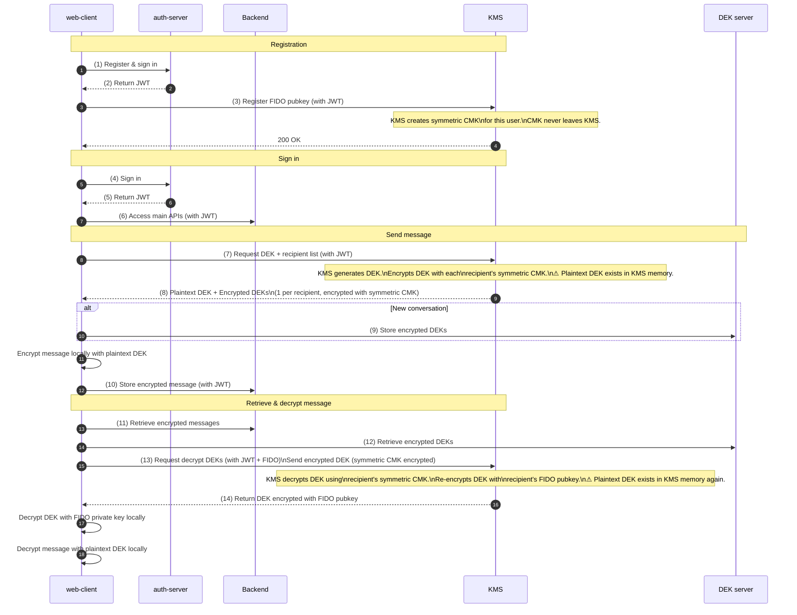
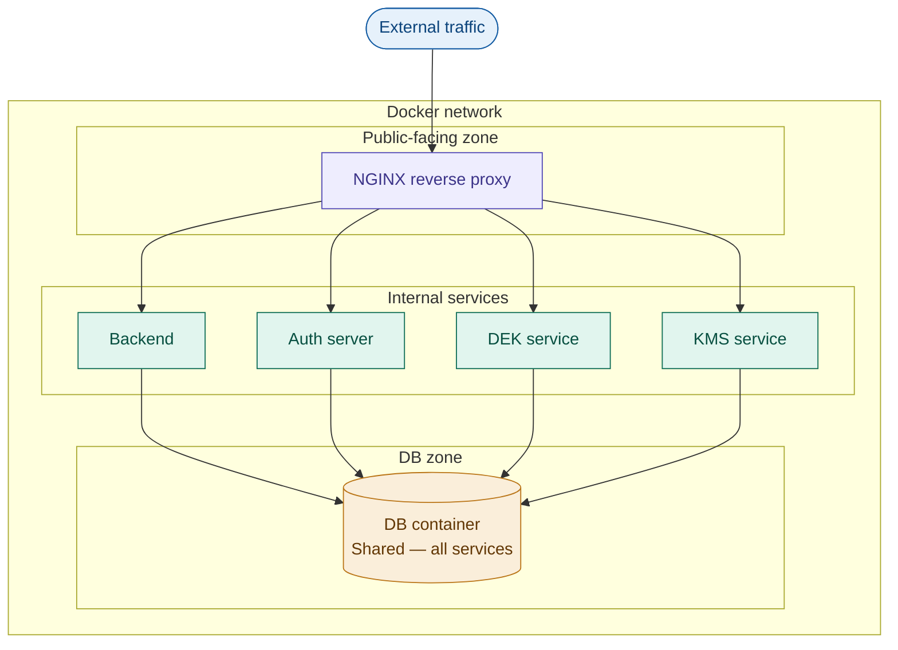
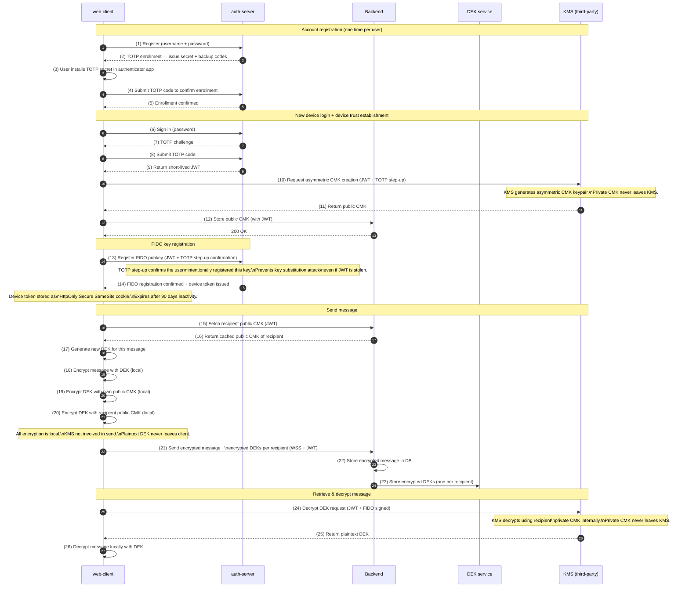
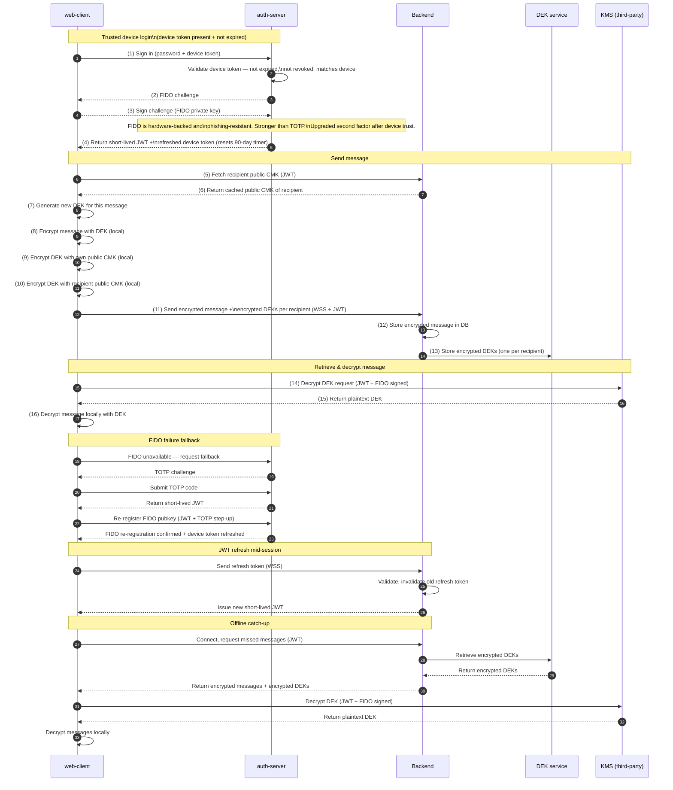
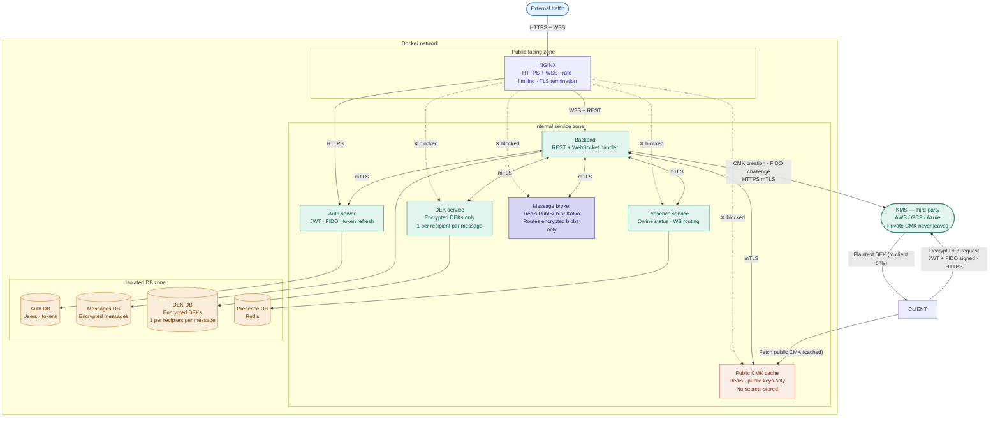
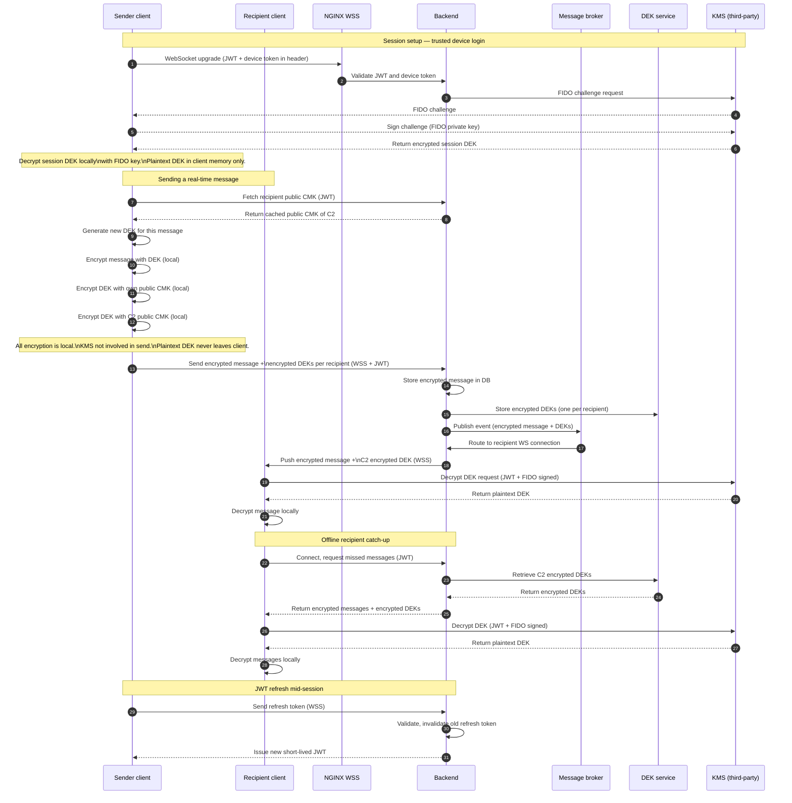

# Security Architecture Design Document

## End-to-End Encrypted Real-Time Messaging System

| Field       | Detail     |
| ----------- | ---------- |
| **Version** | 2.1        |
| **Status**  | Draft      |
| **Date**    | 2026-03-21 |

---

## Table of Contents

1. [Executive Summary](#1-executive-summary)
2. [Project Purpose & Goals](#2-project-purpose--goals)
3. [System Overview](#3-system-overview)
4. [Original Design](#4-original-design)
5. [Security Analysis of Original Design](#5-security-analysis-of-original-design)
6. [Design Decisions & Solutions](#6-design-decisions--solutions)
7. [New Design](#7-new-design)
8. [Real-Time Messaging Extension](#8-real-time-messaging-extension)
9. [Security Properties of New Design](#9-security-properties-of-new-design)
10. [Migration Path](#10-migration-path)
11. [Glossary](#11-glossary)
12. [References](#12-references)

---

## 1. Executive Summary

This document describes the security architecture of an end-to-end encrypted (E2EE) real-time messaging system. It covers the original design, a structured analysis of its security weaknesses, the decisions made to address each weakness, and the resulting revised architecture.

The system is designed so that plaintext message content and plaintext Data Encryption Keys (DEKs) never exist on any server at any point. All encryption and decryption of message content occurs exclusively on the client device. Authentication is enforced using short-lived JWTs combined with FIDO2 hardware-backed signatures. Account registration and new device login require TOTP as a second factor. Subsequent logins on trusted devices use FIDO2 directly, providing a stronger hardware-backed factor after device trust is established. The infrastructure is containerised within a Docker network with strict internal service isolation.

---

## 2. Project Purpose & Goals

### 2.1 Purpose

To provide a secure messaging platform where:

- Message content is end-to-end encrypted and unreadable by any server
- Each user's encryption keys are protected by hardware-backed FIDO2 authentication
- Multiple recipients can receive the same message without the server holding any plaintext

### 2.2 Security Goals

| Goal                            | Description                                                                                                                     |
| ------------------------------- | ------------------------------------------------------------------------------------------------------------------------------- |
| **Confidentiality**             | No server ever holds plaintext message content or plaintext DEKs                                                                |
| **Authentication**              | All sensitive operations require JWT + FIDO2 verification                                                                       |
| **Multi-factor authentication** | Account registration and new device login require TOTP as a second factor; trusted device login uses FIDO2 as the second factor |
| **Integrity**                   | Messages cannot be tampered with in transit or at rest                                                                          |
| **Forward secrecy**             | Each message uses a unique DEK — compromise of one DEK exposes only one message                                                 |
| **Non-repudiation**             | FIDO2 signatures prove client identity for sensitive operations                                                                 |

### 2.3 Non-Goals

- Protection against a fully compromised client device
- Anonymity of message metadata (who spoke to whom, when)
- Protection against a malicious user within a conversation

---

## 3. System Overview

### 3.1 Actors

| Actor           | Description                                                                                                              |
| --------------- | ------------------------------------------------------------------------------------------------------------------------ |
| **Web client**  | Browser or desktop app; performs all local encryption and decryption                                                     |
| **Auth server** | Issues and validates JWTs; manages FIDO2 registration                                                                    |
| **Backend**     | Handles business logic, message storage, and WebSocket connections                                                       |
| **KMS**         | Third-party key management service (AWS KMS / GCP KMS / Azure Key Vault); holds CMKs; never exposes private key material |
| **DEK service** | Stores encrypted DEKs (one per recipient per message); never holds plaintext                                             |
| **NGINX**       | Reverse proxy; sole public-facing entry point; handles TLS termination and rate limiting                                 |

### 3.2 Key Concepts

| Term                    | Description                                                                                                                                                                                                                                                                                                                                               |
| ----------------------- | --------------------------------------------------------------------------------------------------------------------------------------------------------------------------------------------------------------------------------------------------------------------------------------------------------------------------------------------------------- |
| **DEK**                 | Data Encryption Key — symmetric key used to encrypt a single message; generated client-side                                                                                                                                                                                                                                                               |
| **CMK**                 | Customer Master Key — asymmetric keypair held in KMS; public key encrypts DEKs client-side; private key decrypts DEKs inside KMS only                                                                                                                                                                                                                     |
| **FIDO2**               | Hardware-backed authentication standard; client signs a challenge with a private key that never leaves the device                                                                                                                                                                                                                                         |
| **TOTP**                | Time-based One-Time Password — a 6-digit code generated by an authenticator app (e.g. Google Authenticator, Authy) that rotates every 30 seconds; used as the second factor for account registration, new device login, and FIDO key registration step-up confirmation                                                                                    |
| **Device trust**        | A state granted to a device after successful TOTP verification and FIDO key registration; represented by a long-lived device token stored client-side; expires after 90 days of inactivity                                                                                                                                                                |
| **Device token**        | A long-lived signed token issued to a trusted device; scoped to the device and user; revocable server-side; stored as an HttpOnly Secure SameSite cookie                                                                                                                                                                                                  |
| **Envelope encryption** | A two-layer encryption pattern where a DEK encrypts the message (inner envelope) and a CMK encrypts the DEK (outer envelope). In this system, the wrap operation (DEK encryption) is performed client-side using the recipient's public CMK. The unwrap operation (DEK decryption) is performed inside KMS using the private CMK, which never leaves KMS. |

---

## 4. Original Design

### 4.1 Original System Flow

### 4.2 Original Architecture

### 4.3 DEK Encryption Model

The original design uses **envelope encryption** with **symmetric CMKs**:

- One message is encrypted once with a DEK (inner envelope)
- The DEK is encrypted separately for each recipient using that recipient's symmetric CMK inside KMS (outer envelope)
- KMS performs both the wrap (DEK encryption) and unwrap (DEK decryption) operations — this is the standard symmetric envelope encryption pattern
- This is equivalent to the PGP / S/MIME model and is cryptographically sound
- Storage is efficient: one ciphertext stored, N small encrypted DEK entries stored

> **Note on terminology:** The original design follows standard symmetric envelope encryption as defined by AWS KMS / GCP KMS / Azure Key Vault, where KMS both wraps and unwraps the DEK using a symmetric CMK. The new design (section 7) uses a **client-side asymmetric envelope encryption** variant — the wrap is performed client-side using the recipient's public CMK, and KMS only performs the unwrap using the private CMK. Both are forms of envelope encryption; they differ in where the wrap operation occurs and whether the CMK is symmetric or asymmetric.

> **Note on authentication:** The original design had no second factor at account registration or login. Password alone was sufficient to register an account and obtain a JWT. This is identified as a weakness in §5.8.

---

## 5. Security Analysis of Original Design

### 5.1 Plaintext DEK Exposure in KMS (Critical)

| Field        | Detail                    |
| ------------ | ------------------------- |
| **Severity** | Critical                  |
| **Location** | Steps 7–8 and steps 13–14 |

**Description:** The symmetric CMK model requires KMS to generate the DEK and encrypt it for each recipient (steps 7–8), and later to decrypt the DEK and re-encrypt it with the FIDO pubkey (steps 13–14). In both operations, the plaintext DEK exists inside KMS memory.

**Impact:** If KMS is compromised — via memory dump, side-channel attack, or insider threat — every DEK processed during the compromise window is exposed. Because the original design already uses per-message DEKs, each exposed DEK reveals only one message. However, a sustained or undetected KMS compromise could expose all messages processed during that period.

**Root cause:** Symmetric CMK requires the same party (KMS) to both encrypt and decrypt. There is no way to let clients encrypt DEKs locally without exposing the symmetric key itself.

---

### 5.2 KMS Directly Reachable via NGINX (Critical)

| Field        | Detail                       |
| ------------ | ---------------------------- |
| **Severity** | Critical                     |
| **Location** | Architecture — NGINX routing |

**Description:** NGINX routes external traffic directly to KMS. KMS is the most sensitive service in the system — it holds all CMKs — yet it is reachable directly from the internet through the proxy.

**Impact:** Increases KMS attack surface. Any misconfiguration of NGINX routing rules could expose KMS directly. DDoS and brute-force attacks can target KMS directly.

**Root cause:** All services including KMS were placed behind NGINX without distinguishing between public-facing and internal-only services.

---

### 5.3 Shared Database Container (Critical)

| Field        | Detail                      |
| ------------ | --------------------------- |
| **Severity** | Critical                    |
| **Location** | Architecture — DB container |

**Description:** All services (Auth, Backend, DEK, KMS) share a single database container with no stated isolation between schemas or users.

**Impact:** A SQL injection or application-layer breach in any single service can expose data belonging to all other services. Auth tokens, encrypted messages, encrypted DEKs, and key material are all co-located.

**Root cause:** Single shared database chosen for simplicity without per-service isolation.

---

### 5.4 FIDO Key Registration Vulnerable to Substitution (Medium)

| Field        | Detail                            |
| ------------ | --------------------------------- |
| **Severity** | Medium                            |
| **Location** | Step 3 — FIDO pubkey registration |

**Description:** FIDO public key registration requires only a JWT. If a JWT is compromised before FIDO registration, an attacker can register their own FIDO key and impersonate the user for all subsequent DEK decryption operations.

**Impact:** Full account takeover for message decryption. The attacker can decrypt all future messages sent to this user.

**Root cause:** Single-factor confirmation for a high-privilege registration operation.

---

### 5.5 JWT as Sole Auth for Most Operations (Medium)

| Field        | Detail                 |
| ------------ | ---------------------- |
| **Severity** | Medium                 |
| **Location** | Steps 6, 7, 10, 11, 12 |

**Description:** JWT is the only authentication mechanism for the majority of operations. JWTs are stateless — once issued they cannot be revoked before expiry. No token binding to device or session is shown.

**Impact:** A stolen JWT grants wide access to message storage, retrieval, and DEK operations until expiry. Logout does not invalidate the token.

**Root cause:** Stateless JWT used without short expiry enforcement, rotation policy, or token binding.

---

### 5.6 No Service-to-Service Authentication (Medium)

| Field        | Detail                  |
| ------------ | ----------------------- |
| **Severity** | Medium                  |
| **Location** | Internal Docker network |

**Description:** Inside the Docker network, services can communicate freely using Docker internal DNS. No mutual authentication between services is shown.

**Impact:** A compromised internal service can impersonate any other service. Backend could call KMS or DEK service without any credential verification.

**Root cause:** Internal network trusted implicitly — no zero-trust posture inside the Docker network.

---

### 5.7 Incomplete Key Rotation Policy (Low)

| Field        | Detail      |
| ------------ | ----------- |
| **Severity** | Low         |
| **Location** | System-wide |

**Description:** The original design already uses per-message DEKs — each message has a unique DEK, so DEK rotation is inherently in place. However, no rotation policy is defined for CMKs, FIDO keys, or JWT signing keys.

**Impact:** A compromised CMK could be used to unwrap any encrypted DEK stored in the DEK service until the CMK is rotated. A long-lived FIDO key increases the window of exposure if a device is lost or compromised. The blast radius per message is already limited by the per-message DEK design.

**Root cause:** Key lifecycle management for CMKs, FIDO keys, and JWT signing keys not addressed in the original design. DEK rotation was already correctly handled.

### 5.8 No Multi-Factor Authentication at Registration and Login (Medium)

| Field        | Detail                                           |
| ------------ | ------------------------------------------------ |
| **Severity** | Medium                                           |
| **Location** | Steps 1–2 (registration) and steps 4–5 (sign in) |

**Description:** Account registration and login require only a password. There is no second factor verifying that the person registering or signing in is the legitimate owner of the account. A stolen or guessed password is sufficient to obtain a JWT and access the system.

**Impact:** An attacker with a stolen password can register an account or sign in, obtain a JWT, and proceed to register a FIDO key or access encrypted messages. All downstream security properties (FIDO, DEK protection) depend on the initial login being legitimate — without 2FA this assumption can be violated.

**Root cause:** Multi-factor authentication not included in the original design.

---

## 6. Design Decisions & Solutions

### 6.1 Switch from Symmetric CMK to Asymmetric CMK

**Problem addressed:** §5.1 — Plaintext DEK exposure in KMS

**Options considered:**

| Option                                       | Description                                                                  | Verdict                                           |
| -------------------------------------------- | ---------------------------------------------------------------------------- | ------------------------------------------------- |
| Keep symmetric CMK                           | No change — KMS continues to generate and encrypt DEKs                       | ❌ Rejected — plaintext DEK always in KMS memory  |
| Store encrypted messages per recipient       | One ciphertext copy per recipient instead of shared DEK                      | ❌ Rejected — O(N) storage, impractical for media |
| Asymmetric CMK — client encrypts DEK locally | Client fetches recipient public CMK, encrypts DEK locally; KMS only decrypts | ✅ Selected                                       |

**Decision:** Switch to asymmetric CMK (RSA or ECC). The public CMK is retrievable and cacheable by clients. Clients encrypt DEKs locally using the recipient's public CMK. KMS only performs decryption using the private CMK, which never leaves KMS.

**Trade-offs accepted:**

- Requires asymmetric CMK support from KMS provider (all major providers support this)
- Requires a public CMK cache inside the Docker network to avoid per-message KMS calls for key fetching
- Public CMKs must be invalidated and refreshed on CMK rotation

---

### 6.2 Isolate KMS from NGINX Routing

**Problem addressed:** §5.2 — KMS directly reachable via NGINX

**Decision:** Remove KMS from NGINX routing table entirely. KMS (third-party) is accessed directly by the client for decryption operations over HTTPS, and by the Backend for session setup. NGINX never proxies traffic to KMS.

**Trade-offs accepted:** Clients make direct HTTPS calls to the third-party KMS endpoint for decryption — this is acceptable as third-party KMS providers expose authenticated public HTTPS APIs designed for this purpose.

---

### 6.3 Separate Database Per Service

**Problem addressed:** §5.3 — Shared database container

**Decision:** Replace the single shared DB container with four isolated databases, one per service. Each service holds credentials only for its own database. Cross-service data access at the database layer is architecturally impossible.

**Trade-offs accepted:** Slightly higher infrastructure overhead. Migrations and backups must be managed per database.

---

### 6.4 Require TOTP Step-Up Confirmation for FIDO Key Registration

**Problem addressed:** §5.4 — FIDO key substitution attack

**Decision:** FIDO pubkey registration requires JWT plus a TOTP code as a step-up confirmation. This ensures that even a stolen JWT cannot be used to register a malicious FIDO key — the attacker would also need physical possession of the user's TOTP device.

**Why TOTP rather than a separate email OTP:** The system already requires TOTP as a second factor at login (§6.8). Reusing TOTP for this step-up confirmation means one fewer OTP mechanism in the system, a consistent user experience (same authenticator app, same code type), and no dependency on email delivery reliability. This is the same pattern used by Google and GitHub, which require your existing 2FA code to confirm adding a new security key. The TOTP code here is not authentication — it is a step-up authorization confirming that a sensitive operation was intentionally initiated by the legitimate user.

**Trade-offs accepted:** User must have their TOTP device available when registering a new FIDO key. Acceptable given that this is a one-time operation per device.

---

### 6.5 Short-Lived JWT with Rotation

**Problem addressed:** §5.5 — JWT as sole auth

**Decision:** JWTs are issued with short expiry (15 minutes). A refresh token rotation mechanism is implemented — refresh tokens are single-use and invalidated on use. For WebSocket sessions, JWT refresh is performed in-band over the WebSocket connection before expiry.

**Trade-offs accepted:** Slightly more complex token management. Acceptable given the security benefit of near-real-time revocation capability.

---

### 6.6 mTLS Between Internal Services

**Problem addressed:** §5.6 — No service-to-service authentication

**Decision:** All service-to-service communication inside the Docker network uses mutual TLS (mTLS). Each service holds a certificate issued by an internal CA. Services reject connections from uncertified peers.

**Trade-offs accepted:** Certificate management overhead. Internal CA must be maintained and rotated.

---

### 6.7 Define CMK and FIDO Key Rotation Policy

**Problem addressed:** §5.7 — Incomplete key rotation policy

**Decision:** Per-message DEK was already in place in the original design — no change required there. The new design adds explicit rotation policies for the remaining key types: CMK rotation is defined per-provider (e.g. annual rotation in AWS KMS); FIDO key rotation is triggered on device change or security event; JWT signing key rotation is performed on a scheduled basis by the Auth server.

**Trade-offs accepted:** CMK rotation requires re-wrapping all stored encrypted DEKs with the new CMK — this is a background operation that must be planned carefully to avoid availability impact.

---

### 6.8 Introduce TOTP as Unified Second Factor

**Problem addressed:** §5.8 — No multi-factor authentication at registration and login

**Options considered:**

| Option                             | Security     | UX                | Notes                                                    | Verdict     |
| ---------------------------------- | ------------ | ----------------- | -------------------------------------------------------- | ----------- |
| SMS OTP                            | 🟠 Lower     | Low friction      | Vulnerable to SIM swapping                               | ❌ Rejected |
| Email OTP                          | 🟡 Medium    | Low friction      | Depends on email account security                        | ❌ Rejected |
| Push notification (Duo, Okta)      | ✅ High      | Very low friction | Requires third-party service dependency                  | ❌ Rejected |
| TOTP (Google Authenticator, Authy) | ✅ High      | Low friction      | App-based; no phone number dependency; widely understood | ✅ Selected |
| Hardware key (YubiKey)             | ✅ Very high | Medium friction   | Redundant given FIDO2 already covers hardware auth       | ❌ Rejected |

**Decision:** TOTP is introduced as the second factor for account registration, new device login, and FIDO key registration step-up confirmation (§6.4). A single TOTP mechanism covers all three events, reducing system complexity and providing a consistent user experience.

**Why TOTP is also used for FIDO key registration step-up (not just login):** The FIDO key registration step-up could have used a separate email OTP. TOTP was chosen instead for three reasons: (1) the user already has their TOTP device available at registration time since TOTP was just used to log in; (2) it eliminates a dependency on email delivery reliability for a security-critical operation; (3) it keeps the number of distinct OTP mechanisms in the system to one, reducing implementation surface area and user confusion. This mirrors the pattern used by Google and GitHub.

**Recovery path:** At TOTP enrollment, the user is issued backup codes for account recovery if the TOTP device is lost. Additionally, recovery via email + identity verification is available as a secondary recovery path. Both recovery paths are documented in the operational runbook.

**Trade-offs accepted:**

- Users must install and maintain a TOTP authenticator app
- TOTP codes are time-sensitive — clock skew on the client device can cause failures; a ±30 second tolerance window is applied server-side
- TOTP does not protect against phishing of the code itself — mitigated by the short 30-second window

---

### 6.9 Progressive Device Trust — TOTP on New Device, FIDO on Trusted Device

**Problem addressed:** §5.8 — No multi-factor authentication; and UX optimisation for returning users on trusted devices

**Options considered:**

| Option                                      | Security | UX                          | Verdict                                                        |
| ------------------------------------------- | -------- | --------------------------- | -------------------------------------------------------------- |
| TOTP on every login                         | High     | Friction on every login     | ❌ Rejected — unnecessary friction once device is trusted      |
| FIDO only after first login                 | High     | Smooth                      | ❌ Rejected — FIDO alone cannot establish initial device trust |
| TOTP on new device → FIDO on trusted device | ✅ High  | ✅ Smooth after first login | ✅ Selected                                                    |

**Decision:** Authentication follows a progressive trust model:

- **New device:** Password → TOTP → FIDO key registration (confirmed with TOTP) → device token issued
- **Trusted device (subsequent logins):** Password → FIDO signature → JWT issued
- **FIDO failure on trusted device:** Password → TOTP fallback → re-register FIDO → device token refreshed

**Why TOTP gates initial device trust rather than FIDO alone:** FIDO2 private keys are generated and stored on the device hardware — they cannot be exported and are implicitly device-scoped. However, FIDO alone cannot bootstrap trust on a brand new device because there is no FIDO key registered yet. TOTP, which is independent of the device, provides the second factor needed to safely establish that first trust anchor. Once FIDO is registered, it serves as a stronger hardware-backed second factor for all subsequent logins on that device, eliminating the need to open an authenticator app on every login.

**Why FIDO replaces TOTP rather than supplementing it:** FIDO2 is a stronger factor than TOTP — it is hardware-backed, phishing-resistant (bound to the origin), and requires physical user presence. Requiring both TOTP and FIDO on every trusted device login would add friction without meaningful additional security. The progressive model upgrades the second factor from TOTP to FIDO after trust is established, following the same pattern used by Apple ID and GitHub.

**Device token lifetime:** Device tokens expire after **90 days of inactivity** — the industry standard used by Google, GitHub, and AWS. This balances security (auto-expiry limits the window of a lost device being exploited) with UX (active users are not repeatedly asked to re-verify). On expiry, the user must complete the new device flow again (Password → TOTP → FIDO).

**Device token storage:** Device token is stored as an HttpOnly, Secure, SameSite=Strict cookie — not in localStorage or sessionStorage — to prevent XSS-based theft.

**Device token revocation:** Users can revoke individual device tokens from a trusted device or via the email recovery path. Revocation immediately invalidates the device token and the associated FIDO key server-side. This is the primary response to a lost or stolen device.

**Session vs device trust distinction:**

| Concept           | Mechanism                                | Lifetime           | Purpose                               |
| ----------------- | ---------------------------------------- | ------------------ | ------------------------------------- |
| **Session trust** | Short-lived JWT (15 min) + refresh token | Minutes to hours   | Authorises API calls within a session |
| **Device trust**  | Device token (HttpOnly cookie)           | 90 days inactivity | Allows FIDO-only login on this device |

**Trade-offs accepted:**

- Device token management adds server-side state (device token store in Auth DB)
- 90-day inactivity window means a rarely-used device may silently lose trust and surprise the user
- FIDO failure fallback (TOTP re-registration) must be carefully rate-limited to prevent it becoming an attack vector

---

## 7. New Design

### 7.1 Revised System Flow

#### New Device Flow

#### Trusted Device Flow

### 7.2 Revised Architecture

### 7.3 How Each Weakness Is Addressed

| Weakness                       | Original                                   | New Design                                                             |
| ------------------------------ | ------------------------------------------ | ---------------------------------------------------------------------- |
| Plaintext DEK in KMS           | ❌ KMS generates and holds plaintext DEK   | ✅ Client encrypts DEK locally; KMS only decrypts                      |
| KMS reachable via NGINX        | ❌ NGINX routes to KMS                     | ✅ KMS removed from NGINX; third-party KMS accessed directly by client |
| Shared database                | ❌ Single DB for all services              | ✅ One isolated DB per service                                         |
| FIDO key substitution          | ❌ JWT only for registration               | ✅ JWT + TOTP step-up confirmation required                            |
| JWT revocation                 | ❌ Long-lived, no rotation                 | ✅ Short-lived + single-use refresh token rotation                     |
| No internal service auth       | ❌ Open internal network                   | ✅ mTLS between all internal services                                  |
| Incomplete key rotation        | ✅ Per-message DEK already in place        | ✅ CMK + FIDO + JWT signing key rotation policies added                |
| No multi-factor authentication | ❌ Password only at registration and login | ✅ TOTP on new device; FIDO on trusted device; progressive trust model |

---

## 8. Real-Time Messaging Extension

### 8.1 New Components

| Component             | Purpose                                                                                                |
| --------------------- | ------------------------------------------------------------------------------------------------------ |
| **WebSocket handler** | Persistent client connections managed inside Backend                                                   |
| **Message broker**    | Redis Pub/Sub or Kafka; routes encrypted message blobs between WebSocket nodes; internal only          |
| **Presence service**  | Tracks online status and WebSocket connection routing                                                  |
| **Public CMK cache**  | Redis cache of recipient public CMKs; eliminates per-message KMS calls for key fetching; internal only |

### 8.2 Real-Time Flow

### 8.3 Offline Recipients

Because the sender encrypts the DEK locally using the recipient's public CMK (which is cached and always available), there is no special handling required for offline recipients. The sender can always encrypt for any recipient regardless of their online status. When the offline recipient reconnects, they retrieve their encrypted DEKs and decrypt them locally — the same flow as real-time delivery.

This is a direct benefit of the asymmetric CMK model and eliminates the need for a pre-key bundle system.

### 8.4 Additional Security Considerations for Real-Time

| Concern                          | Mitigation                                                                  |
| -------------------------------- | --------------------------------------------------------------------------- |
| WebSocket JWT expiry mid-session | In-band JWT refresh over WSS before expiry                                  |
| Long-lived WebSocket session     | Periodic FIDO re-challenge every N hours                                    |
| Message broker as attack surface | Broker is internal only; blocked from NGINX; passes encrypted blobs only    |
| Connection flooding              | Rate limit WebSocket upgrades at NGINX; max concurrent connections per user |
| Dead connections                 | Heartbeat / ping-pong mechanism to detect and close stale connections       |

---

## 9. Security Properties of New Design

### 9.1 Guarantees

| Property                        | Guarantee                                                                                 |
| ------------------------------- | ----------------------------------------------------------------------------------------- |
| **Plaintext DEK isolation**     | Plaintext DEK exists only in client memory; never on any server                           |
| **Plaintext message isolation** | Plaintext message exists only in client memory; never on any server                       |
| **Private CMK isolation**       | Private CMK exists only inside third-party KMS; never transmitted                         |
| **Forward secrecy**             | Each message uses a unique DEK; compromise of one DEK exposes one message only            |
| **Authentication strength**     | All DEK decryption requires JWT + FIDO2 hardware signature                                |
| **Multi-factor authentication** | New device login requires password + TOTP; trusted device login requires password + FIDO2 |
| **Device trust isolation**      | Device tokens expire after 90 days of inactivity; individually revocable server-side      |
| **Internal service isolation**  | mTLS enforced between all services; no implicit trust inside Docker network               |
| **Database isolation**          | Per-service databases; cross-service data access architecturally impossible               |

### 9.2 Remaining Risks

| Risk                                  | Severity | Mitigation                                                                                                     |
| ------------------------------------- | -------- | -------------------------------------------------------------------------------------------------------------- |
| Compromised client device             | High     | Out of scope — device security is the user's responsibility                                                    |
| Third-party KMS provider breach       | High     | Asymmetric CMK model limits exposure to decryption operations only; no plaintext DEKs stored in KMS            |
| JWT theft via XSS                     | Medium   | Short-lived JWT; Content Security Policy; HttpOnly cookies for token storage                                   |
| TOTP code phishing                    | Medium   | 30-second code window limits usability; FIDO replaces TOTP on trusted devices eliminating ongoing exposure     |
| Lost TOTP device                      | Medium   | Backup codes issued at enrollment; email + identity verification recovery path available                       |
| Device token theft                    | Medium   | HttpOnly Secure SameSite cookie prevents JS access; 90-day inactivity expiry; server-side revocation available |
| Metadata exposure (who messaged whom) | Low      | Accepted — out of scope for this design                                                                        |
| Public CMK cache poisoning            | Medium   | CMK cache is internal only; cache entries signed and validated against KMS on TTL refresh                      |

### 9.3 Security Assumptions

- The client device and browser are not compromised
- The third-party KMS provider operates honestly and securely
- TLS certificates are valid and certificate pinning is enforced where applicable
- FIDO2 private keys are stored in hardware-backed secure enclaves (TPM, Secure Enclave)
- The user's TOTP device and authenticator app are not compromised
- Backup codes are stored securely by the user and not exposed

---

## 10. Migration Path

### 10.1 Phase 1 — Infrastructure Isolation

1. Split shared DB into four isolated databases with per-service credentials
2. Remove KMS and DEK service from NGINX routing table
3. Implement mTLS between all internal services
4. Deploy public CMK cache (Redis) as internal-only service

### 10.2 Phase 2 — CMK Migration

1. Generate new asymmetric CMK keypair per user in third-party KMS
2. Re-encrypt existing DEKs: decrypt with old symmetric CMK, re-encrypt with new asymmetric public CMK
3. Distribute new public CMKs to public CMK cache
4. Deprecate symmetric CMK operations in KMS

### 10.3 Phase 3 — Auth Hardening

1. Enforce short-lived JWT expiry and refresh token rotation
2. Implement in-band JWT refresh for WebSocket sessions
3. Deploy TOTP enrollment flow at account registration — issue backup codes and confirm TOTP setup before account activation
4. Update login flow: new device requires password + TOTP; issue device token after FIDO registration
5. Update login flow: trusted device requires password + FIDO; refresh device token on successful login
6. Implement FIDO failure fallback: TOTP challenge + FIDO re-registration + device token refresh
7. Replace FIDO key registration email/SMS OTP confirmation with TOTP step-up confirmation
8. Implement device token revocation — user-facing "manage trusted devices" screen and admin revocation API
9. Implement device token inactivity expiry — 90-day sliding window, reset on each successful login

### 10.4 Phase 4 — Real-Time Extension

1. Add WebSocket support to Backend and NGINX
2. Deploy message broker (Redis Pub/Sub or Kafka) as internal-only service
3. Deploy presence service
4. Implement periodic FIDO re-challenge for long-lived WebSocket sessions

---

## 11. Glossary

| Term                     | Definition                                                                                                                                                                                                                                                  |
| ------------------------ | ----------------------------------------------------------------------------------------------------------------------------------------------------------------------------------------------------------------------------------------------------------- |
| **ADR**                  | Architecture Decision Record — a document capturing a single architectural decision                                                                                                                                                                         |
| **Backup codes**         | One-time use recovery codes issued at TOTP enrollment; used to regain account access if the TOTP device is lost                                                                                                                                             |
| **CMK**                  | Customer Master Key — a keypair managed by KMS used to protect DEKs                                                                                                                                                                                         |
| **DEK**                  | Data Encryption Key — a symmetric key used to encrypt a single message                                                                                                                                                                                      |
| **Device token**         | A long-lived signed token issued to a device after successful TOTP verification and FIDO registration; stored as an HttpOnly Secure SameSite cookie; expires after 90 days of inactivity; revocable server-side                                             |
| **Device trust**         | A state granted to a device after completing the new device flow (password + TOTP + FIDO registration); allows FIDO-only login on subsequent logins until the device token expires or is revoked                                                            |
| **E2EE**                 | End-to-End Encryption — encryption where only communicating clients can read messages                                                                                                                                                                       |
| **Envelope encryption**  | A two-layer pattern where a DEK encrypts data and a CMK encrypts the DEK. The wrap (DEK encryption) and unwrap (DEK decryption) operations may be performed by KMS (symmetric) or by the client using an asymmetric CMK public key (this system's approach) |
| **FIDO2**                | Fast IDentity Online 2 — a standard for hardware-backed passwordless authentication                                                                                                                                                                         |
| **JWT**                  | JSON Web Token — a signed token used for stateless authentication                                                                                                                                                                                           |
| **KMS**                  | Key Management Service — a service that creates, stores, and manages cryptographic keys                                                                                                                                                                     |
| **mTLS**                 | Mutual TLS — TLS where both client and server authenticate with certificates                                                                                                                                                                                |
| **Step-up confirmation** | A TOTP code submitted to authorize a sensitive operation (e.g. FIDO key registration); not authentication — it confirms intentional authorization of a specific action by the legitimate user                                                               |
| **TOTP**                 | Time-based One-Time Password — a 6-digit code generated by an authenticator app (e.g. Google Authenticator, Authy) that rotates every 30 seconds; used as the second factor for new device login and as step-up confirmation for FIDO key registration      |
| **Unwrap**               | The KMS operation that decrypts an encrypted DEK using the private CMK; the CMK never leaves KMS                                                                                                                                                            |
| **WebAuthn**             | Web Authentication API — the browser API implementing FIDO2                                                                                                                                                                                                 |
| **Wrap**                 | The operation that encrypts a plaintext DEK using a CMK; performed client-side in this system using the recipient's public CMK                                                                                                                              |
| **WSS**                  | WebSocket Secure — WebSocket over TLS                                                                                                                                                                                                                       |

---

## 12. References

| Reference                                     | Description                                                                                |
| --------------------------------------------- | ------------------------------------------------------------------------------------------ |
| FIDO2 / WebAuthn                              | https://fidoalliance.org/fido2/                                                            |
| AWS KMS asymmetric keys                       | https://docs.aws.amazon.com/kms/latest/developerguide/symmetric-asymmetric.html            |
| Google Cloud KMS                              | https://cloud.google.com/kms/docs                                                          |
| Azure Key Vault                               | https://learn.microsoft.com/en-us/azure/key-vault/                                         |
| RFC 7519 — JWT                                | https://datatracker.ietf.org/doc/html/rfc7519                                              |
| RFC 6238 — TOTP                               | https://datatracker.ietf.org/doc/html/rfc6238                                              |
| Signal Protocol                               | https://signal.org/docs/                                                                   |
| OWASP Transport Layer Security Cheat Sheet    | https://cheatsheetseries.owasp.org/cheatsheets/Transport_Layer_Security_Cheat_Sheet.html   |
| OWASP Multi-Factor Authentication Cheat Sheet | https://cheatsheetseries.owasp.org/cheatsheets/Multifactor_Authentication_Cheat_Sheet.html |
